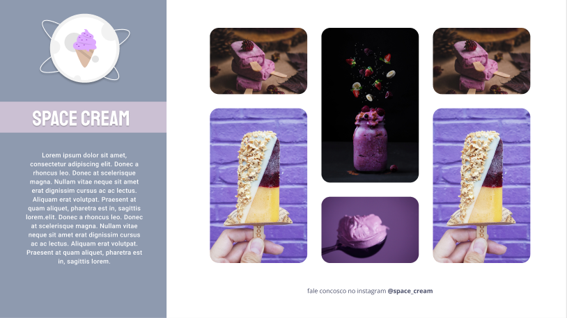
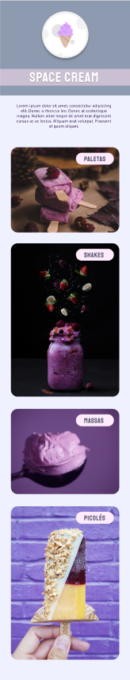

#  Projeto: Space Cream

## 💻 Versão Desktop

 

## 📲 Versão Mobile

 

## 📌 Sobre o Projeto

Desafio proposto no programa Explorer da Rocketseat.
Assuntos importantes aplicados: 
  
  * Mobile First;
  * CSS grid
  * Transições e Transformações
  * Animações com CSS
  * Media queries

Figma: 
  * [Versão Mobile](https://www.figma.com/file/mtnc6YFkI3n6E8crLfc07S/Stage-03---Mobile-First-(Copy))
  * [Versão Desktop](https://www.figma.com/file/dPhkxdyPmwvaGNcEcNM5Wk/Stage-03---Grid-com-anima%C3%A7%C3%B5es-(Copy))

 

## 📌 Tecnologias 

Esse projeto foi desenvolvido com as seguintes tecnologias:

* HTML
* CSS

 

## 📝 Licença

Esse projeto está sob a licença MIT. Veja o arquivo [LICENSE](LICENSE) para mais detalhes.

 
 

<h4 align="center">
    Por Rodrigo de Morais 🚀
</h4>